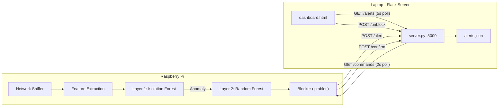
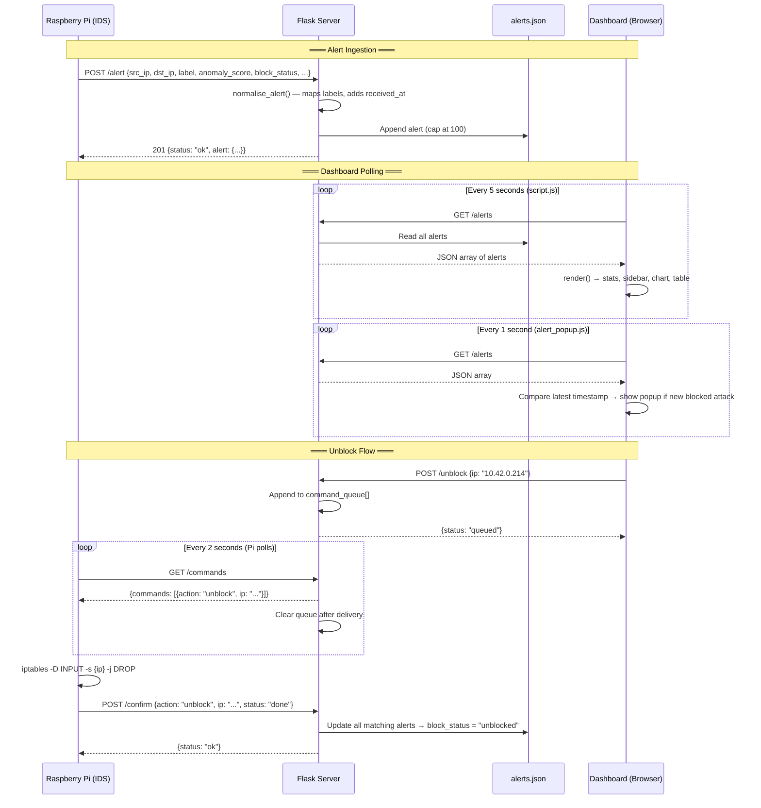
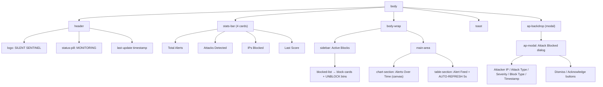
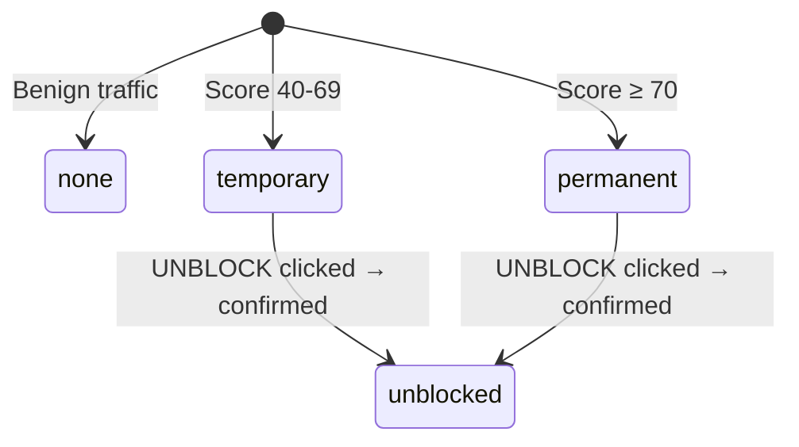

# Silent Sentinel IDS — Dashboard Architecture Analysis

## 1. System Overview

Silent Sentinel is a **real-time ML-powered Intrusion Detection System** with a two-layer detection pipeline (Isolation Forest → Random Forest) deployed on a Raspberry Pi, reporting alerts to a Flask-based monitoring dashboard running on a laptop.



---

## 2. File Structure & Roles

| File | Size | Role |
|------|------|------|
| [server.py](file:///c:/project/new%20project/dashboard/server.py) | 6 KB | Flask backend — receives alerts, serves static files, manages command queue |
| [dashboard.html](file:///c:/project/new%20project/dashboard/dashboard.html) | 5 KB | Main UI shell — header, stats, sidebar, chart canvas, alert table, modal markup |
| [script.js](file:///c:/project/new%20project/dashboard/script.js) | 10 KB | Dashboard logic — polling, rendering, Chart.js timeline, unblock actions |
| [style.css](file:///c:/project/new%20project/dashboard/style.css) | 13 KB | Full dashboard styling — dark brutalist theme, responsive layout |
| [alert_popup.js](file:///c:/project/new%20project/dashboard/alert_popup.js) | 12 KB | Alert popup system — modal control, Web Audio buzzer, independent 1s poller |
| [alert_popup.css](file:///c:/project/new%20project/dashboard/alert_popup.css) | 10 KB | Popup modal styling — SOC-style minimal dark card |
| [alert_popup.html](file:///c:/project/new%20project/dashboard/alert_popup.html) | 8 KB | Standalone demo page for testing popup in isolation |
| [alerts.json](file:///c:/project/new%20project/dashboard/alerts.json) | 3 KB | Persistent alert storage — JSON array, max 100 entries |

---

## 3. Data Flow Diagram



---

## 4. Code Structure Analysis

### 4.1 [server.py](file:///c:/project/new%20project/dashboard/server.py) — Flask Backend

| Section | Lines | Purpose |
|---------|-------|---------|
| Config | [L14-17](file:///c:/project/new%20project/dashboard/server.py#L14-L17) | `ALERTS_FILE`, `MAX_ALERTS=100`, `PORT=5000`, `HOST=0.0.0.0` |
| App setup | [L20-21](file:///c:/project/new%20project/dashboard/server.py#L20-L21) | Flask app with `static_folder="."`, CORS enabled |
| Command queue | [L24](file:///c:/project/new%20project/dashboard/server.py#L24) | In-memory list for unblock commands |
| [load_alerts](file:///c:/project/new%20project/dashboard/server.py#L26-L34) | L26-34 | Reads `alerts.json`, returns `[]` on error |
| [save_alerts](file:///c:/project/new%20project/dashboard/server.py#L36-L38) | L36-38 | Writes alerts with `indent=2` |
| [normalise_alert](file:///c:/project/new%20project/dashboard/server.py#L40-L65) | L40-65 | Maps raw labels → canonical types via `label_map` |
| Routes | L67-149 | 6 endpoints (see API section below) |

> [!IMPORTANT]
> The command queue is **in-memory only** — it will be lost on server restart. This is acceptable for a capstone demo but would need Redis/DB in production.

#### Label Normalization Map
```python
"ANOMALY"     → "DDoS"       "DDOS"        → "DDoS"
"DOS"         → "DoS"        "PORTSCAN"    → "PortScan"
"PORT_SCAN"   → "PortScan"   "BRUTEFORCE"  → "BruteForce"
"BRUTE_FORCE" → "BruteForce" "BENIGN"      → "Benign"
"NORMAL"      → "Benign"
```

---

### 4.2 [dashboard.html](file:///c:/project/new%20project/dashboard/dashboard.html) — UI Structure



**External dependencies loaded via CDN:**
- Google Fonts: `Share Tech Mono` (monospace data) + `Rajdhani` (UI headings)
- Chart.js 4.4.1 (UMD build)

---

### 4.3 [script.js](file:///c:/project/new%20project/dashboard/script.js) — Dashboard Logic

| Function | Lines | Purpose |
|----------|-------|---------|
| [fetchAlerts](file:///c:/project/new%20project/dashboard/script.js#L7-L18) | L7-18 | `GET /alerts` → parse JSON → `render()` → update timestamp |
| [render](file:///c:/project/new%20project/dashboard/script.js#L21-L40) | L21-40 | Orchestrator — computes stats, rebuilds `blockedIPs` set, calls 3 sub-renderers |
| [renderSidebar](file:///c:/project/new%20project/dashboard/script.js#L43-L66) | L43-66 | Builds blocked IP cards with attack type, badge, UNBLOCK button |
| [renderTimeline](file:///c:/project/new%20project/dashboard/script.js#L69-L146) | L69-146 | Chart.js line chart — 20 buckets × 1-minute windows |
| [renderTable](file:///c:/project/new%20project/dashboard/script.js#L149-L212) | L149-212 | Alert feed table — reverse chronological, score bars, badges |
| [badgeHTML](file:///c:/project/new%20project/dashboard/script.js#L215-L225) | L215-225 | Maps attack type → CSS class for colored badges |
| [unblockIP](file:///c:/project/new%20project/dashboard/script.js#L228-L244) | L228-244 | `POST /unblock` → optimistic UI update → toast |
| [showToast](file:///c:/project/new%20project/dashboard/script.js#L247-L252) | L247-252 | Bottom-right notification, auto-dismiss 3s |

#### How Polling Works
```javascript
// Line 255-256 — Two independent polling loops
fetchAlerts();                    // Initial fetch on page load
setInterval(fetchAlerts, 5000);   // Dashboard data: every 5 seconds
// alert_popup.js also polls /alerts every 1 second independently
```

#### How the Anomaly Score Bar Works
```javascript
// Lines 162-171 — Inline CSS bar with conditional color
`<div class="score-bar-fill"
     style="width:${score}%;
            background:${score >= 70 ? 'var(--danger)' 
                       : score >= 40 ? 'var(--warn)' 
                       : 'var(--ok)'}">
</div>`
```
- **≥70**: `var(--danger)` → `#f5f5f5` (white/high contrast)
- **40-69**: `var(--warn)` → `#bbbbbb` (gray/medium)
- **<40**: `var(--ok)` → `#8f8f8f` (dim/low)

#### How the Timeline Chart Works
```javascript
// Lines 69-146 — 20 one-minute buckets, sliding window
const buckets = 20;
const bucketMs = 60 * 1000;  // 1 minute per bucket
// For each alert, calculate which bucket it falls into based on (now - timestamp)
// Chart.js line chart with fill, no animation, monospace tooltip
```

> [!NOTE]
> The chart shows a **rolling 20-minute window**. Alerts older than 20 minutes won't appear on the chart, though they remain in the table.

#### How UNBLOCK Works (Frontend)
```javascript
// Lines 228-244
async function unblockIP(ip) {
  const res = await fetch('/unblock', {
    method: 'POST',
    headers: { 'Content-Type': 'application/json' },
    body: JSON.stringify({ ip })
  });
  // Optimistic: remove from sidebar immediately
  blockedIPs.delete(ip);
  renderSidebar();
}
```

#### Attack Type Badge Classification
| Pattern Match | CSS Class | Attack Types |
|---------------|-----------|-------------|
| `ddos` | `badge-ddos` | DDoS |
| `dos` | `badge-dos` | DoS |
| `portscan`, `port` | `badge-portscan` | PortScan |
| `brute` | `badge-bruteforce` | BruteForce |
| `benign`, `normal` | `badge-benign` | Benign |
| (fallback) | `badge-default` | WEBATTACK, INFILTRATION, UNKNOWN |

---

### 4.4 [style.css](file:///c:/project/new%20project/dashboard/style.css) — Theme & Layout

#### Design System Variables
```css
--bg:        #000000     /* Pure black background */
--panel:     #0b0b0b     /* Card surfaces */
--border:    #212121     /* Subtle borders */
--accent:    #f2f2f2     /* Primary text/values */
--danger:    #f5f5f5     /* High severity (near-white) */
--warn:      #bbbbbb     /* Medium severity */
--ok:        #8f8f8f     /* Low severity */
--font-mono: 'Share Tech Mono'  /* Data values */
--font-ui:   'Rajdhani'         /* Headings/labels */
```

> [!TIP]
> The theme is **brutalist monochrome** — no color is used. Severity is conveyed through luminosity alone (brighter = more dangerous). This is a deliberate design choice from the previous conversation [66269cf1](file:///c:/project/new%20project/dashboard).

#### Layout Architecture
- **Header**: Flex, centered with `min(1360px, calc(100% - 28px))`
- **Stats bar**: CSS Grid `repeat(4, 1fr)`
- **Body wrap**: Flex row — sidebar (280px fixed) + main area (flex: 1)
- **Main area**: Column flex — chart section (112px) + table section (flex: 1, scrollable)
- **Responsive**: 980px → sidebar stacks on top; 640px → single-column stats

#### Animations
| Animation | Duration | Element |
|-----------|----------|---------|
| `pulse-ring` | 3.2s | Logo icon — breathing glow |
| `blink` | 2s | Status dot — heartbeat |
| `chip-in` | 0.25s | Block cards — slide up on appear |
| `row-in` | 0.28s | Table rows — slide in from left |

---

### 4.5 [alert_popup.js](file:///c:/project/new%20project/dashboard/alert_popup.js) — Alert Modal System

#### Public API
```javascript
window.showAlert(config)  // Show popup with alert data
window.hideAlert()        // Dismiss programmatically
window.showSentinelAlert  // Alias for showAlert
```

#### Config Object
```javascript
showAlert({
  title:         string,   // Default: "⚠ Attack Blocked"
  message:       string,   // Auto-generated from attack_type
  ip:            string,   // Attacker IP
  attack_type:   string,   // DDoS, DoS, PortScan, BruteForce
  anomaly_score: number,   // 0-100
  block_status:  string,   // "permanent" | "temporary"
  timestamp:     string    // ISO timestamp
});
```

#### Key Mechanisms

**Deduplication**: Uses `_lastTimestamp` to only trigger on genuinely new alerts. On first load, it seeds the timestamp without showing a popup.

**Web Audio Buzzer**: 3 × 880Hz square wave beeps (480ms ON / 280ms OFF). AudioContext is pre-warmed on first user gesture (click/keydown) to comply with browser autoplay policies.

**Independent Polling**: Polls `/alerts` every **1 second** (faster than the dashboard's 5s) to catch new alerts quickly. Only triggers popup for non-benign, blocked attacks.

**Auto-dismiss**: 6 seconds with visual timer bar that shrinks from left to right.

**Severity Theming**:
| Score Range | Severity | Accent Color | Score Color |
|-------------|----------|-------------|-------------|
| ≥ 70 | High | `#7a1a1a` (muted red) | `#c0392b` |
| 40-69 | Medium | `#7a4d1a` (muted amber) | `#b06030` |
| < 40 | Low | Default gray | `#7a7a7a` |

---

### 4.6 [alerts.json](file:///c:/project/new%20project/dashboard/alerts.json) — Data Storage

#### Schema
```json
{
  "timestamp":     "2026-03-31T02:38:24",     // ISO 8601 from Pi
  "src_ip":        "10.42.0.214",             // Attacker IP
  "dst_ip":        "192.168.10.2",            // Server/target IP
  "attack_type":   "DDoS",                    // Normalized label
  "anomaly_score": 71.6,                      // 0-100 float
  "received_at":   "2026-03-31 02:38:25",     // Server receipt time
  "protocol":      "TCP",                     // Can be "TCP", 6, 17, 1
  "label":         "DDOS",                    // Raw label from Pi
  "block_status":  "unblocked"                // none|temporary|permanent|unblocked
}
```

#### Block Status Lifecycle


> [!NOTE]
> There are **two** `alerts.json` files — one in `/dashboard/` (used by the server) and one in the project root (different data). The server uses the one in its own directory.

---

## 5. API Endpoint Documentation

| Method | Endpoint | Source | Purpose | Request Body | Response |
|--------|----------|--------|---------|-------------|----------|
| `GET` | `/` | Browser | Serve `dashboard.html` | — | HTML |
| `GET` | `/<path>` | Browser | Serve static files (CSS/JS) | — | File |
| `POST` | `/alert` | Raspberry Pi | Ingest new alert | `{src_ip, dst_ip, label, anomaly_score, block_status, protocol, timestamp}` | `201 {status: "ok", alert: {...}}` |
| `GET` | `/alerts` | Dashboard | Fetch all alerts | — | `200 [alert, ...]` |
| `POST` | `/unblock` | Dashboard | Queue unblock command | `{ip: "x.x.x.x"}` | `200 {status: "queued"\|"already_queued", ip}` |
| `GET` | `/commands` | Raspberry Pi | Poll pending commands | — | `200 {commands: [{action, ip}, ...]}` |
| `POST` | `/confirm` | Raspberry Pi | Confirm command execution | `{action: "unblock", ip: "...", status: "done"}` | `200 {status: "ok"}` |

---

## 6. Answers to Key Questions

### Q1: How does the dashboard poll for new alerts?
**Two independent polling loops:**
1. `script.js` line 256: `setInterval(fetchAlerts, 5000)` — refreshes stats, chart, and table every 5 seconds
2. `alert_popup.js` line 291: `setInterval(_poll, 1000)` — checks for new blocked attacks every 1 second for popup triggers

Both hit `GET /alerts` independently. The popup poller is faster to ensure timely notifications.

### Q2: How is the anomaly score visualized?
A `52px`-wide horizontal bar (`score-bar-bg`) with a fill div whose `width` is set to `{score}%`. Color is determined inline:
- `≥70` → `var(--danger)` (bright white in brutalist theme)
- `40-69` → `var(--warn)` (gray)
- `<40` → `var(--ok)` (dim gray)

### Q3: How does the UNBLOCK button work?
1. **Frontend**: `unblockIP(ip)` → `POST /unblock {ip}` → optimistic removal from sidebar
2. **Server**: Adds `{action: "unblock", ip}` to in-memory `command_queue`
3. **Pi polls**: `GET /commands` every 2s → receives pending commands → queue cleared on read
4. **Pi executes**: `iptables -D INPUT -s {ip} -j DROP` (in `blocker.py`)
5. **Pi confirms**: `POST /confirm {action: "unblock", ip, status: "done"}`
6. **Server updates**: All alerts with matching `src_ip` → `block_status = "unblocked"`

### Q4: What's the structure of alerts.json?
An array of alert objects capped at 100 entries (FIFO). See schema in Section 4.6 above.

### Q5: How are attack types color-coded?
In the brutalist theme, they're differentiated by **luminosity** only:
- `badge-ddos`: white text, brightest border
- `badge-dos`: slightly dimmer
- `badge-portscan`: mid-gray
- `badge-bruteforce`: dark gray
- `badge-benign`: dimmest

The popup modal uses actual color (muted red for high severity, amber for medium).

### Q6: How is the chart populated and updated?
- Creates 20 one-minute buckets from `now - 20min` to `now`
- Iterates all alerts, places each into a bucket based on `now - timestamp`
- On first render: creates new Chart.js line chart
- On subsequent renders: updates data in-place with `chart.update('none')` (no animation)

---

## 7. Simulation Phase Recommendations

> [!IMPORTANT]
> For the capstone demo, you'll need to simulate realistic attack scenarios. Here's a practical approach:

### 7.1 Simulation Script
Create a `simulate_attacks.py` that POSTs alerts to `/alert`:

```python
import requests, time, random
from datetime import datetime

SERVER = "http://localhost:5000/alert"
ATTACKS = [
    {"label": "DOS",        "anomaly_score": lambda: round(random.uniform(55, 85), 2)},
    {"label": "DDOS",       "anomaly_score": lambda: round(random.uniform(70, 98), 2)},
    {"label": "PORTSCAN",   "anomaly_score": lambda: round(random.uniform(40, 75), 2)},
    {"label": "BRUTEFORCE", "anomaly_score": lambda: round(random.uniform(50, 90), 2)},
    {"label": "BENIGN",     "anomaly_score": lambda: round(random.uniform(5, 25), 2)},
]

SRC_IPS = ["10.42.0.214", "192.168.1.100", "172.16.0.50", "10.0.0.99"]
DST_IP  = "192.168.10.2"

while True:
    atk = random.choice(ATTACKS)
    alert = {
        "src_ip": random.choice(SRC_IPS),
        "dst_ip": DST_IP,
        "label": atk["label"],
        "anomaly_score": atk["anomaly_score"](),
        "protocol": random.choice(["TCP", "UDP"]),
        "timestamp": datetime.now().isoformat(),
        "block_status": "temporary" if atk["label"] != "BENIGN" else "none",
    }
    # High-severity attacks get permanent blocks
    if alert["anomaly_score"] >= 70 and alert["label"] != "BENIGN":
        alert["block_status"] = "permanent"
    
    requests.post(SERVER, json=alert)
    print(f"→ {alert['label']:12s}  score={alert['anomaly_score']:.1f}  {alert['src_ip']}")
    time.sleep(random.uniform(3, 12))  # 3-12 seconds between alerts
```
